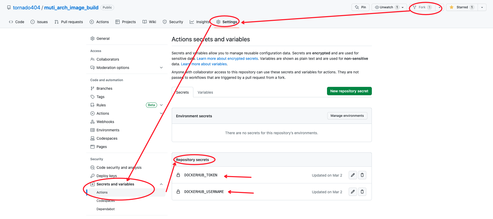

# 避免网络不通导致依赖包无法安装的镜像构建方法

## 简介
镜像构建现状：

- 404Not found、从`apt-get update`到`docker pull`、`github`访问不通等多重问题困扰，原本轻易能实现的镜像构建变成了一天以上的工作量；
- 换个思路，可以去vlutr网站购买一台海外服务器实例，构建完镜像并推送到dockerhub，就销毁，这种方式的金钱消耗<0.5元/次，耗时将缩短至服务器的购买时间5min+创建时间15min（没错，创建到真正能ssh登录耗时约15min）

`muti_arch_image_build`功能概括：

- 镜像构建无障碍，利用GitHub服务器的网络能力进行镜像构建,流畅安装各种包，并推送到dockerhub
- 构建流程全程透明可见，无需担心隐私信息泄露
- 单次构建耗时低于10min
- 镜像构建使用github服务器,镜像存储使用dockerhub,0成本

解决了什么问题：

1. 国内网络问题，DNS不通，大量依赖包需要配置国内源才能下载安装
2. 全程免费

适用场景:
- 因不可抗力导致镜像构建困难,大量包无法下载
- 镜像里不存储你的银行卡密码(我想没有人会将敏感信息打到镜像里)

## 初始化配置

1. fork本项目,
2. 给fork后的项目,在`settings->Security -> Actions -> Repository secrets` 中添加以下字段
    - DOCKERHUB_TOKEN
    - DOCKERHUB_USERNAME

   其中DOCKERHUB_USERNAME为dockerhub的用户名，DOCKERHUB_TOKEN为dockerhub的密码

## 1. 简易使用方式(推荐)

 
1. 修改dockerfiles/Dockerfile,在第一行添加注释, 注释后接构建的镜像名称, 需包含上一步骤中配置的`DOCKERHUB_USERNAME`值,例如:`# zzc932/ubuntu:latest` 
2. `dockerfiles/Dockerfile`后续内容,添加上完整的Dockerfile

## 2. 命令行使用方式(不够方便,但可以自动化)
详情查看[命令行方式自动化执行](docs/base/README.md)